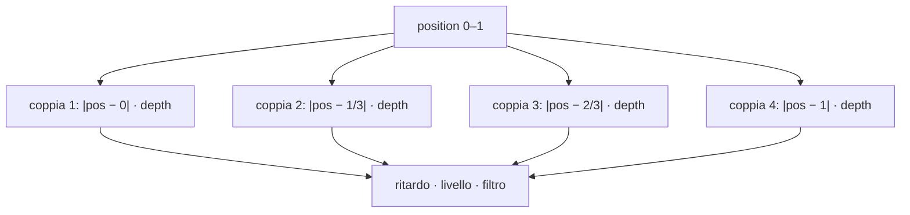
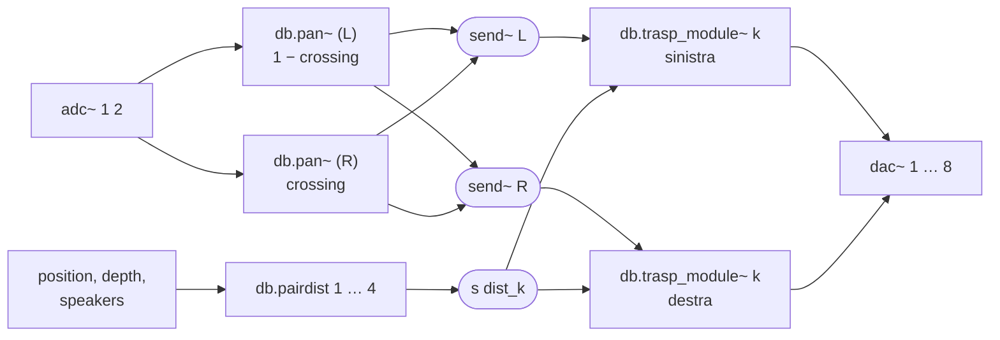
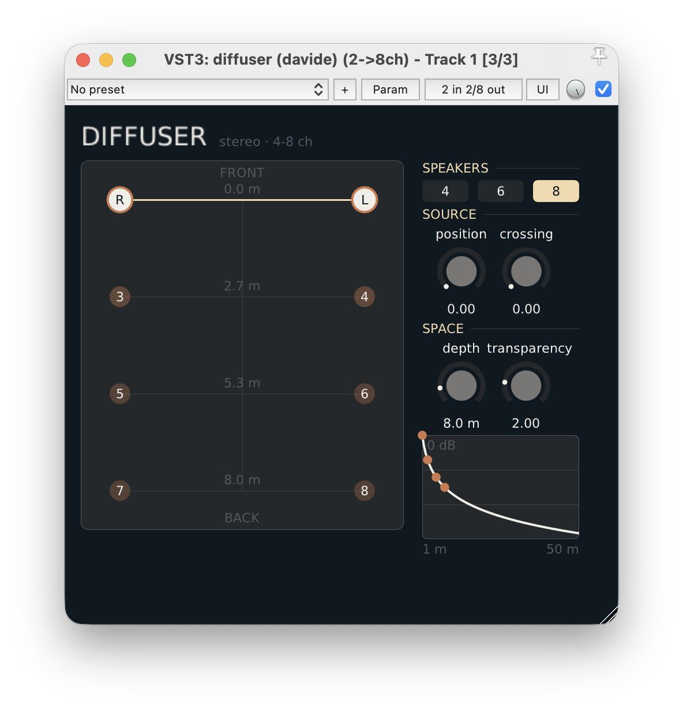
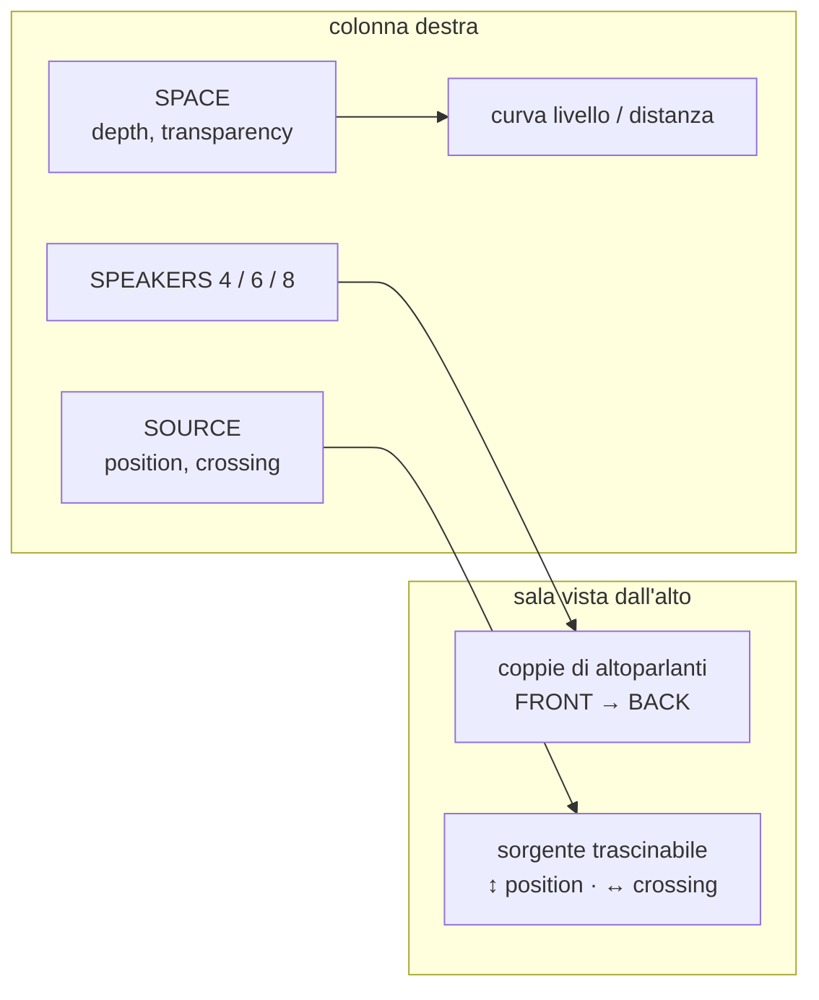

---
date:
  created: 2026-10-06
authors:
  - davide
tags:
  - spatializzazione
  - diffusione
  - panning
  - plugin
  - puredata
  - hvcc
  - vst3
categories:
  - Plugin
---

# Diffuser

Un segnale stereo diffuso su 4, 6 o 8 altoparlanti disposti a coppie, dal fronte al retro della sala.

---------------------------------------------

<!-- more -->

## Introduzione

Molti materiali nascono stereo, ma in concerto o in installazione si ha spesso a disposizione un impianto multicanale. **Diffuser** prende un segnale stereo e lo distribuisce su **coppie di altoparlanti** disposte una dietro l'altra: la coppia 1 sul fronte, l'ultima sul retro.

Con due soli controlli principali si decide:

- **position**: in che punto della sala, tra fronte e retro, si trova il suono;
- **crossing**: come i due canali stereo si dispongono tra sinistra e destra, dalla stereofonia normale al mono fino all'inversione dei lati.


Le coppie che stanno vicino alla posizione scelta suonano piene e senza ritardo; quelle lontane arrivano più tardi, più deboli e più scure, con la stessa logica di [Lontananza](../lontananza/lontananza.md). Il plugin è stato sviluppato con l'ambiente descritto in [Sviluppo plugins in PureData con HVCC e DPF](../sviluppo-vst-hvcc/sviluppo-vst-hvcc.md); il codice è nella [repository dev_plugin](https://github.com/dvddmg/dev_plugin/tree/main/src/diffuser){target="_blank"}.

## Teoria

### Disposizione degli altoparlanti

Gli altoparlanti sono organizzati in coppie: i canali dispari a sinistra, i pari a destra.

| Altoparlanti | Coppie | Canali (sinistra / destra) |
|---|---|---|
| 4 | 2 | 1/2 fronte, 3/4 retro |
| 6 | 3 | 1/2 fronte, 3/4 centro, 5/6 retro |
| 8 | 4 | 1/2, 3/4, 5/6, 7/8 dal fronte al retro |

Ogni coppia `k` (numerata da 0) ha una posizione normalizzata tra 0 (fronte) e 1 (retro):

```text
posizione_k = k / (coppie − 1)
```

### Distanza dalla sorgente

Il parametro **position** (0–1) indica dove si trova la sorgente lungo lo stesso asse. Per ogni coppia si calcola la distanza in metri tra sorgente e coppia, scalata dal parametro **depth**, cioè la profondità della sala:

```text
distanza_k = max(1, |position − posizione_k| · depth)
```

La coppia più vicina alla sorgente si trova a 1 metro, il minimo; le altre si allontanano in proporzione.

### Ritardo, livello e filtro

Ogni altoparlante applica alla propria distanza le tre trasformazioni già viste in [Lontananza](../lontananza/lontananza.md):

```text
ritardo_ms = d / 343 · 1000
guadagno   = 1 / d^trasparenza
taglio_Hz  = (1 − d / 50) · 18000 + 2000
```

Esempio con 8 altoparlanti, depth 8 m e trasparenza 2:

| position | coppia 1/2 | coppia 3/4 | coppia 5/6 | coppia 7/8 |
|---|---|---|---|---|
| 0 (fronte) | 1 m · 0 dB | 2,7 m · −17 dB | 5,3 m · −29 dB | 8 m · −36 dB |
| 0,5 (centro) | 4 m · −24 dB | 1,3 m · −5 dB | 1,3 m · −5 dB | 4 m · −24 dB |
| 1 (retro) | 8 m · −36 dB | 5,3 m · −29 dB | 2,7 m · −17 dB | 1 m · 0 dB |

Spostando position da 0 a 1, il suono attraversa la sala dal fronte al retro.



### Crossing: panning a potenza costante

Prima della diffusione, i due canali in ingresso passano per un panning a **potenza costante**: i guadagni sono radici quadrate, così la somma dei quadrati resta 1 e il volume non cambia durante il movimento.

| crossing | L in → sinistra | L in → destra | R in → sinistra | R in → destra | risultato |
|---|---|---|---|---|---|
| 1 | 1 | 0 | 0 | 1 | stereo normale (LR) |
| 0,5 | 0,707 | 0,707 | 0,707 | 0,707 | mono |
| 0 | 0 | 1 | 1 | 0 | lati invertiti (RL) |

## Patch Pd

La patch è composta da quattro file:

- `diffuser.pd`: la patch principale;
- `db.pan~.pd`: il panning a potenza costante di un canale d'ingresso;
- `db.pairdist.pd`: calcola la distanza di **una** coppia dalla sorgente;
- `db.trasp_module~.pd`: ritardo, livello e filtro di **un** altoparlante.



### db.pan~

Riceve il segnale e un valore di pan tra 0 e 1. Il valore passa per `[line 0 100]`, con una rampa di **1 secondo**, poi si divide in due rami:

- `sqrt(1 − p)` per l'uscita sinistra;
- `sqrt(p)` per l'uscita destra.

Nella patch principale il canale R usa direttamente crossing, mentre il canale L usa `1 − crossing`. Le uscite di entrambi si sommano su `send~ L` e `send~ R`.

### db.pairdist

L'argomento `$1` è il numero della coppia. L'abstraction calcola `($1 − 1) / max(coppie − 1, 1)`, ne fa la differenza in valore assoluto con position, moltiplica per depth e manda il risultato, con un minimo di 1 m, a `[s dist_$1]`. Si ricalcola ogni volta che cambiano position, depth o il numero di altoparlanti.

### db.trasp_module~

È la stessa catena di Lontananza (`delread4~`, `1 / d^trasparenza`, `lop~`, `clip~`), con due differenze:

- le rampe sono molto più lente: **5 secondi** per il ritardo e **500 ms** per il livello;
- il segnale finale viene moltiplicato per un interruttore `[r npairs]` → `[>= $1]`, che spegne le coppie in eccesso quando si scelgono meno altoparlanti.

Per ogni coppia ci sono due istanze con lo stesso argomento, una per il lato sinistro e una per il destro: entrambe ricevono la stessa distanza `dist_k`.

## Spiegazione VST

{width="100%"}

### Parametri

| Parametro | Intervallo | Default | Sezione UI |
|---|---|---|---|
| `speakers` | 4 / 6 / 8 | 8 | SPEAKERS |
| `distance` | 0 – 1 | 0 | SOURCE (position) |
| `panning` | 0 – 1 | 0 | SOURCE (crossing) |
| `depth` | 1 – 50 m | 8 m | SPACE |
| `trasp` | 0 – 10 | 2 | SPACE |

Nel `plugin.json`, `speakers` è dichiarato come `enumerator` con i valori `"4"`, `"6"` e `"8"`: nella patch arriva come 0, 1 o 2 e `[+ 2]` lo trasforma nel numero di coppie.

### Interfaccia

Il file dell'interfaccia è [`HeavyDPF_diffuser_UI.cpp`](https://github.com/dvddmg/dev_plugin/blob/main/src/diffuser/ui/HeavyDPF_diffuser_UI.cpp){target="_blank"}.



- **Sala**: mostra le coppie dal fronte al retro, con il numero dei canali e la distanza di ogni coppia dal fronte in metri. Ogni altoparlante è più o meno opaco in base al proprio livello.
- **Sorgente**: una linea orizzontale alla posizione corrente, con i marcatori **L** e **R** degli ingressi. Trascinando nella sala si controllano due parametri insieme: in verticale position, in orizzontale crossing. Quando crossing è al centro, i due marcatori si fondono in un unico **LR**.
- **Curva**: lo stesso grafico livello/distanza di Lontananza, con un punto per ogni coppia attiva.

### Uso nella DAW


[Download](https://github.com/dvddmg/dev_plugin/releases/latest){ .md-button .md-button--primary }
