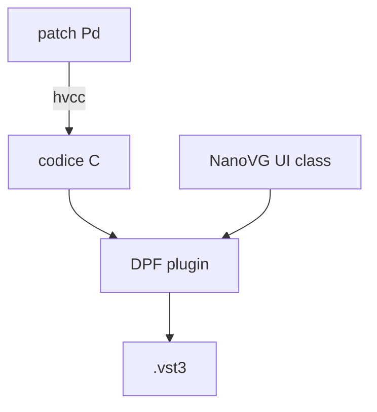

---
date:
  created: 2025-06-01
authors:
  - davide
tags:
  - gui
  - nanovg
  - dpf
  - build
categories:
  - Sviluppo
---

# GUI custom con NanoVG e DPF

Come creare interfacce grafiche personalizzate per i plugin
usando NanoVG dentro il framework DPF.

<!-- more -->

## Perché una GUI custom

Le GUI generate automaticamente da DPF sono funzionali ma
generiche. Per un plugin di spatializzazione serve una
rappresentazione visiva della posizione della sorgente.

## NanoVG

DPF integra NanoVG per il rendering 2D. Si scrive codice
simile a Canvas HTML5:

```cpp
void onNanoDisplay() override {
    float cx = getWidth() / 2.0f;
    float cy = getHeight() / 2.0f;

    // cerchio di sfondo
    beginPath();
    circle(cx, cy, 100.0f);
    strokeColor(200, 200, 200);
    stroke();

    // punto sorgente
    float sx = cx + cos(azimuth) * distance * 100.0f;
    float sy = cy + sin(azimuth) * distance * 100.0f;
    beginPath();
    circle(sx, sy, 6.0f);
    fillColor(255, 255, 255);
    fill();
}
```

## Workflow



!!! note "Submodule pugl"
    DPF usa `pugl` per il windowing. Assicurati di aver
    clonato con `--recursive`, altrimenti la GUI non compila.
