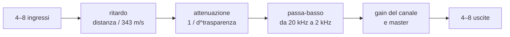
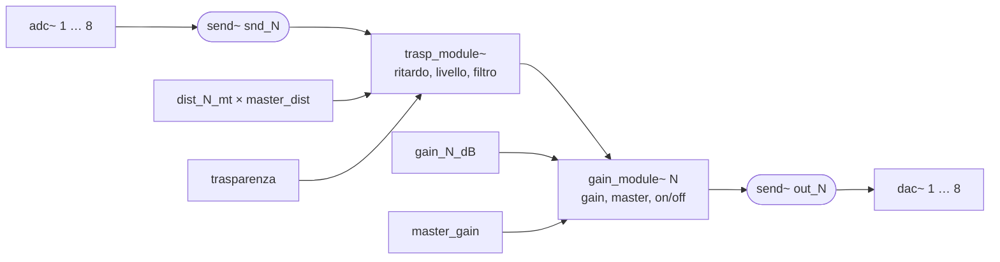
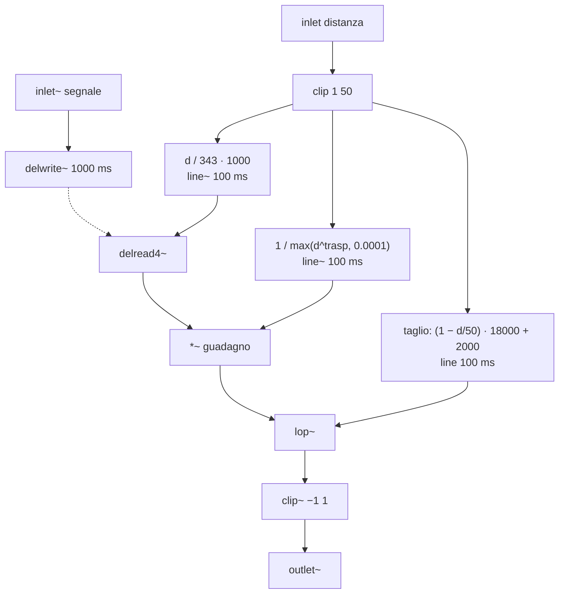
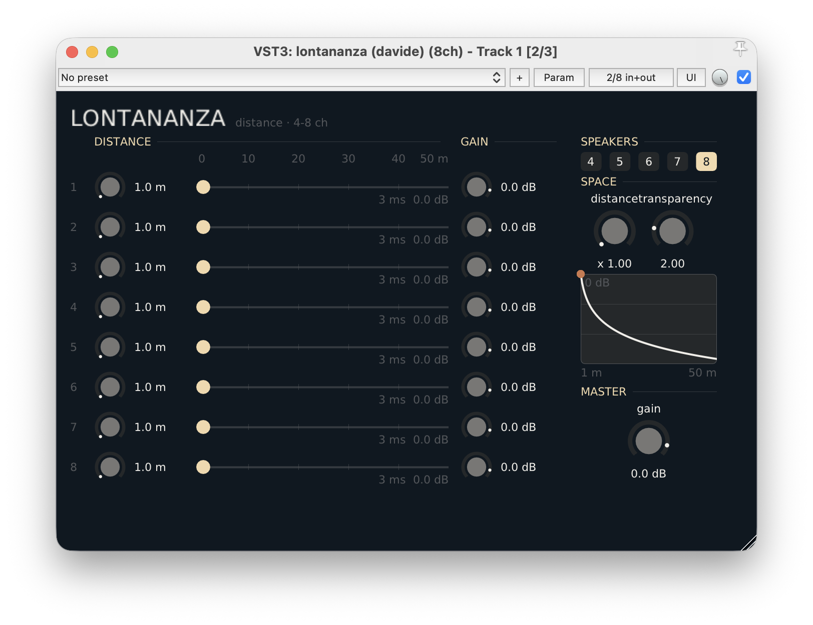
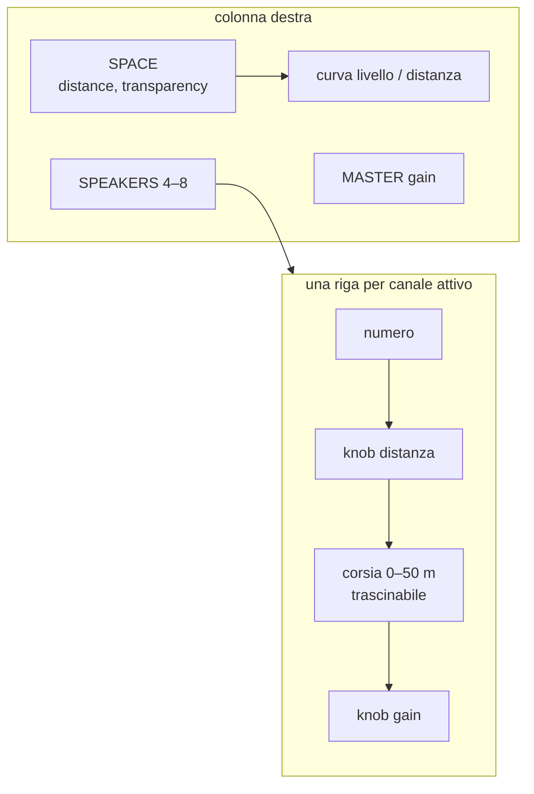

---
date:
  created: 2026-10-06
authors:
  - davide
tags:
  - spatializzazione
  - distanza
  - delay
  - plugin
  - puredata
  - hvcc
  - vst3
categories:
  - Plugin
---

# Lontananza

Da 4 a 8 canali, ognuno collocato a una distanza in metri: ritardo, attenuazione e filtraggio come se l'altoparlante fosse più lontano.

---------------------------------------------

<!-- more -->

## Introduzione

In un impianto multicanale gli altoparlanti sono spesso tutti alla stessa distanza dall'ascoltatore. **Lontananza** permette di allontanare virtualmente ciascun canale: basta indicare quanti metri lo separano dall'ascolto, e il plugin calcola tre effetti che il nostro orecchio associa alla distanza.

1. **Ritardo**: il suono impiega tempo ad arrivare, circa 2,9 ms per ogni metro.
2. **Attenuazione**: più il suono è lontano, più è debole.
3. **Filtraggio**: l'aria assorbe prima le frequenze acute, quindi un suono lontano è più scuro.



Ogni canale è indipendente: l'ingresso 1 esce dall'uscita 1, il 2 dal 2 e così via. Il plugin è stato sviluppato con l'ambiente descritto in [Sviluppo plugins in PureData con HVCC e DPF](../sviluppo-vst-hvcc/sviluppo-vst-hvcc.md); il codice è nella [repository dev_plugin](https://github.com/dvddmg/dev_plugin/tree/main/src/lontananza){target="_blank"}.

!!! note "Insieme a Orbita"

    Lontananza ha lo stesso numero di canali di [Orbita](../orbita/orbita.md). Inserendolo dopo Orbita, la sorgente gira sul cerchio e ogni altoparlante virtuale può avere una distanza diversa: il cerchio diventa una forma irregolare.

    ```mermaid
    flowchart LR
        S["sorgente mono"] --> O["Orbita<br/>posizione sul cerchio"]
        O --> L["Lontananza<br/>distanza di ogni altoparlante"]
        L --> HW["uscite 1–8"]
    ```

## Teoria

### Ritardo

Il suono nell'aria viaggia a circa **343 m/s**. Il ritardo in millisecondi per una distanza `d` in metri è quindi:

```text
ritardo_ms = d / 343 · 1000
```

A 1 metro corrispondono circa 2,9 ms, a 50 metri circa 146 ms. Sopra i 30–40 ms il cervello inizia a percepire il ritardo come un'eco separata e non più come una semplice sensazione di distanza.

### Attenuazione e trasparenza

In campo libero l'ampiezza di un suono diminuisce in proporzione inversa alla distanza: raddoppiando la distanza si perdono 6 dB. Lontananza generalizza questa legge con un esponente, il parametro **trasparenza**:

```text
guadagno = 1 / d^trasparenza
livello_dB = −20 · trasparenza · log10(d)
```

| trasparenza | effetto |
|---|---|
| 0 | nessuna attenuazione: cambiano solo ritardo e filtro |
| 1 | legge fisica dell'inverso della distanza, −6 dB a ogni raddoppio |
| 2 (default) | caduta più ripida, −12 dB a ogni raddoppio |
| 10 | i canali lontani spariscono quasi subito |

!!! note "Perché si chiama trasparenza"

    Il nome descrive l'aria come un mezzo più o meno trasparente al suono: con valori bassi i canali lontani restano udibili; con valori alti l'aria diventa "opaca" e solo i canali vicini arrivano all'ascoltatore.

### Assorbimento dell'aria

L'aria assorbe le alte frequenze più delle basse. Lontananza lo simula con un passa-basso la cui frequenza di taglio scende in modo lineare con la distanza:

```text
taglio_Hz = (1 − d / 50) · 18000 + 2000
```

### Esempio numerico

| distanza | ritardo | livello (trasp. 1) | livello (trasp. 2) | taglio del filtro |
|---|---|---|---|---|
| 1 m | 2,9 ms | 0 dB | 0 dB | 19 640 Hz |
| 2 m | 5,8 ms | −6 dB | −12 dB | 19 280 Hz |
| 5 m | 14,6 ms | −14 dB | −28 dB | 18 200 Hz |
| 10 m | 29,2 ms | −20 dB | −40 dB | 16 400 Hz |
| 20 m | 58,3 ms | −26 dB | −52 dB | 12 800 Hz |
| 50 m | 145,8 ms | −34 dB | −68 dB | 2 000 Hz |

!!! warning "Un filtro percettivo, non fisico"

    L'assorbimento reale dell'aria è molto più leggero: a 50 metri un suono non perde certo tutto sopra i 2 kHz. La curva del filtro è una scelta percettiva, pensata per rendere la distanza più evidente all'ascolto.

## Patch Pd

La patch è composta da tre file:

- `lontananza.pd`: la patch principale, con ingressi, parametri e uscite;
- `trasp_module~.pd`: ritardo, attenuazione e filtro di **un** canale;
- `gain_module~.pd`: gain del canale, master e accensione del canale.



### Distanza di ogni canale

Ogni canale ha il suo parametro `dist_N_mt` (da 1 a 50 metri), moltiplicato per il parametro globale **master_dist** (da 1 a 2). In questo modo si regola la distanza di ogni canale e poi, con un solo knob, si allarga tutto il campo fino al doppio.

### trasp_module~



- Il ritardo usa `[delread4~]`, che interpola tra i campioni: il tempo di ritardo può cambiare in modo continuo senza scatti.
- Ritardo, guadagno e frequenza di taglio arrivano con una rampa di 100 ms.
- Il `[clip~ -1 1]` finale è una protezione: nessun canale può superare il fondo scala.

### gain_module~

Il modulo moltiplica il segnale per tre fattori, ognuno con una rampa di 20 ms:

1. il gain del canale, `gain_N_dB` da −90 a +12 dB;
2. il gain master, `master_gain` da −90 a +12 dB;
3. un interruttore che vale 1 solo se il canale è attivo: `[r nch]` → `[>= $1]`, dove `$1` è il numero del canale.

!!! note "dB nella convenzione di Pd"

    Pd usa una scala in dB in cui 100 corrisponde al guadagno unitario. Per questo i valori in dB del plugin passano per `[+ 100]` → `[dbtorms]`: 0 dB diventa 100, cioè guadagno 1.

## Spiegazione VST

### Parametri

| Parametro | Intervallo | Default | Sezione UI |
|---|---|---|---|
| `inputs` | 4 – 8 | 8 | SPEAKERS |
| `dist_1_mt … dist_8_mt` | 1 – 50 m | 1 m | DISTANCE |
| `gain_1_dB … gain_8_dB` | −90 – +12 dB | 0 dB | GAIN |
| `master_dist` | ×1 – ×2 | ×1 | SPACE |
| `trasparenza` | 0 – 10 | 2 | SPACE |
| `master_gain` | −90 – +12 dB | 0 dB | MASTER |

### Interfaccia

{width="100%"}

Il file dell'interfaccia è [`HeavyDPF_lontananza_UI.cpp`](https://github.com/dvddmg/dev_plugin/blob/main/src/lontananza/ui/HeavyDPF_lontananza_UI.cpp){target="_blank"}.



- **Righe dei canali**: per ogni canale attivo ci sono un knob per la distanza, una **corsia** da 0 a 50 metri e un knob per il gain. L'altoparlante sulla corsia si trascina con il mouse e diventa più scuro man mano che si allontana, come il filtro.
- **Ritardo e livello**: sotto ogni corsia l'interfaccia scrive il ritardo in millisecondi e il livello risultante in dB, sommando gain del canale, master e attenuazione dovuta alla distanza.
- **Curva di attenuazione**: un grafico mostra il livello in funzione della distanza, da 0 a −72 dB, con un punto per ogni canale attivo.

!!! warning "La corsia mostra la distanza effettiva"

    La posizione sulla corsia è la distanza **dopo** il master (`dist_N_mt × master_dist`, limitata a 50 m). Quando trascini l'altoparlante, l'interfaccia divide il valore per il master e lo salva nel parametro del canale: per questo, con master_dist diverso da 1, il knob e la corsia mostrano numeri diversi.

### Uso nella DAW

!!! warning "Serve una traccia a 8 canali"

    Lontananza ha 8 ingressi e 8 uscite: va inserito su una traccia o un bus con almeno 8 canali, in una DAW che gestisca i plugin multicanale (per esempio Reaper). Con `inputs` inferiore a 8 le uscite in eccesso vengono silenziate.

[Download](https://github.com/dvddmg/dev_plugin/releases/latest){ .md-button .md-button--primary }
