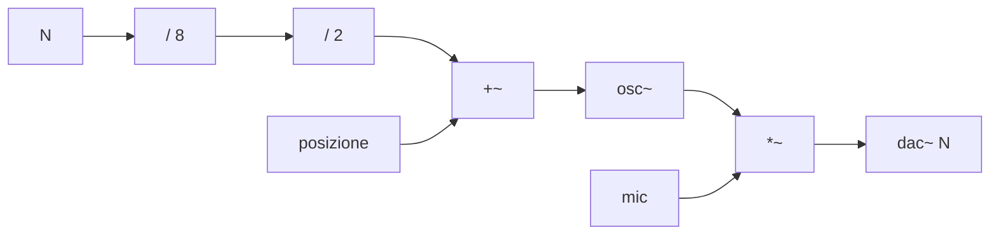

---
date:
  created: 2026-06-02
authors:
  - davide
tags:
  - spatializzazione
  - panning
  - plugin
categories:
  - Plugin
---

# Orbita

Plugin compilato con HVCC e DPF da una patch PureData.

<!-- more -->

## Introduzione

Personalmente ho trovato sempre complicato sviluppare un progetto **multicanale** su DAW. In particolare mi riferisco alla gestione del panning data una sorgente mono o la somma di più sorgenti. Ci sono ovviamente delle possibilità, sia manuali che con plugin, ma personalmente le trovo un po' scomode. L'algoritmo che mi interessava implemetare è il **VBAP** (*Vector Base Amplitude Panning*), che è un algoritmo di panning multicanale che permette di posizionare una sorgente sonora in uno spazio tridimensionale. In questo caso l'implementazione è solo su un piano bidimensionale, rappresentando quindi un **array** circolare di N altoparlanti disposti nello spazio.

## Implementazione

Una sorgente mono viene inviata a 8 moltiplicatori di ampiezza; quest'ultimi sono controllati da otto oscillatori, con frequenza 0 e controllati solo in fase. Normalizzando il valore di fase e dando un offset differente per ciascun moltiplicatore utilizzato, `fase = posizione + idOut / numOut`, otteniamo un defasaggio nella lettura del semi periodo di sinusoide.

La posizione, normalizzata tra 0 e 1, si muove uno spazio simmetrico in cui le N uscite sono equidistanti dal centro.

Un'altro parametro fondamentale per il **VBAP** è il fattore di *spread*. Quest'ultimo l'ho implementato elevando alla potenza il valore prodotto dall'oscillatore. Il segnale viene elevato a potenza per un fattore compreso tra 1 e 100. Più

### Manuale o con periodiche/random

## Sviluppo software

<iframe 
        src="https://www.geogebra.org/material/iframe/id/yjs9wh68/width/1030/height/1181/border/888888/sfsb/true/smb/false/stb/false/stbh/false/ai/false/asb/false/sri/false/rc/false/ld/false/sdz/false/ctl/false" 
        allowfullscreen>
</iframe>

