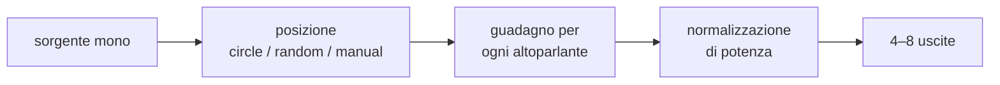
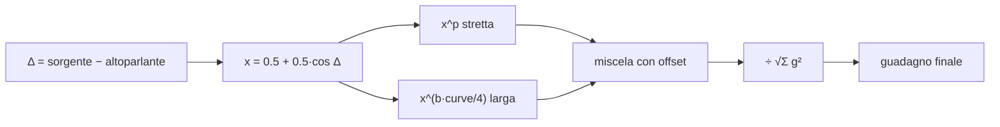
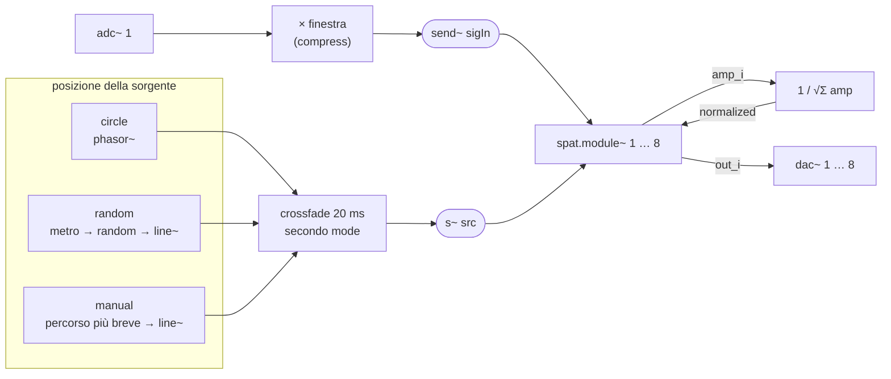
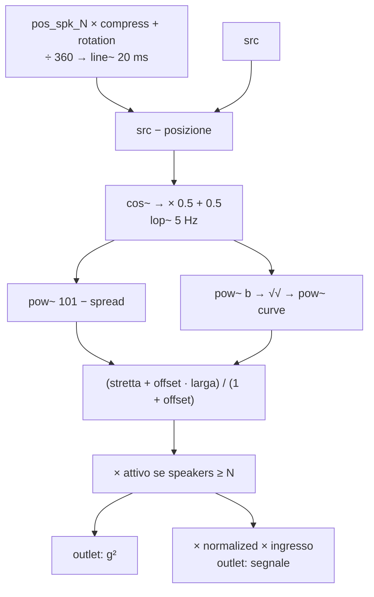
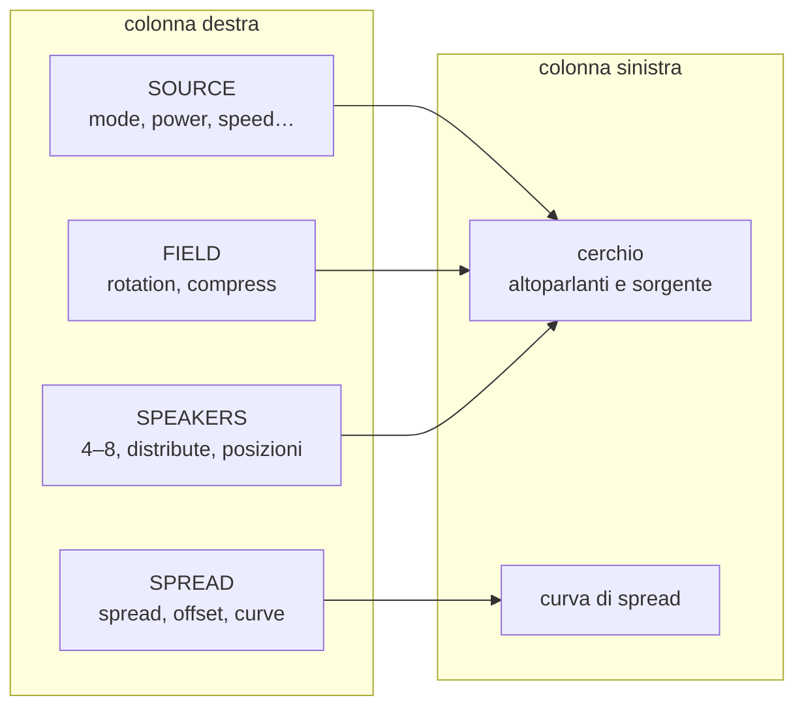
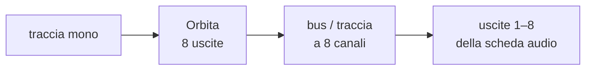

---
date:
  created: 2026-06-02
  updated: 2026-10-06
authors:
  - davide
tags:
  - spatializzazione
  - panning
  - plugin
  - puredata
  - hvcc
  - vst3
categories:
  - Plugin
---

# Orbita

Uno spazializzatore da 4 a 8 canali, scritto come patch PureData e compilato in `VST3` con HVCC e DPF.

---------------------------------------------

<!-- more -->

## Introduzione

Personalmente ho sempre trovato complicato sviluppare un progetto **multicanale** su DAW, in particolare gestire il panning di una sorgente mono o della somma di più sorgenti. Le possibilità ovviamente esistono, sia manuali che con plugin, ma le trovo un po' scomode.

L'idea di partenza è il **VBAP** (*Vector Base Amplitude Panning*), un algoritmo di panning multicanale che posiziona una sorgente sonora nello spazio regolando solo l'ampiezza dei singoli altoparlanti. Qui l'implementazione è limitata al **piano**: un **array circolare** di N altoparlanti (da 4 a 8) disposti attorno all'ascoltatore.

Orbita fa tre cose:

1. **muove** una sorgente mono sul cerchio, in tre modalità: rotazione continua, posizioni casuali o controllo manuale;
2. **calcola** per ogni altoparlante un guadagno che dipende dalla distanza angolare tra sorgente e altoparlante;
3. **normalizza** i guadagni, così il volume percepito resta costante mentre la sorgente si sposta.



Il plugin è stato sviluppato con l'ambiente descritto in [Sviluppo plugins in PureData con HVCC e DPF](../sviluppo-vst-hvcc/sviluppo-vst-hvcc.md); il codice completo è nella [repository dev_plugin](https://github.com/dvddmg/dev_plugin/tree/main/src/orbita){target="_blank"}.

## Teoria

### Distanza angolare e coseno

Ogni altoparlante ha una posizione angolare θᵢ tra -180° e 180°, dove 0° è il fronte. Per ogni altoparlante si calcola la differenza Δᵢ tra la posizione della sorgente e quella dell'altoparlante, e la si trasforma con un coseno riscalato tra 0 e 1:

```text
x_i = 0.5 + 0.5 · cos(Δ_i)
```

Quando la sorgente è esattamente sull'altoparlante, `x = 1`; quando è dalla parte opposta (180°), `x = 0`. Nel mezzo il passaggio è morbido e senza scalini.

### Spread: elevare a potenza

Il coseno da solo è molto largo: con 8 altoparlanti quasi tutti suonano sempre. Per stringere il fascio si eleva `x` a potenza. Più l'esponente è alto, più la curva si restringe attorno all'altoparlante più vicino.

In Orbita il parametro **spread** (0–100) controlla l'esponente in modo inverso: `p = 101 - spread`. Con spread a 0 l'esponente è 101 e suona quasi solo l'altoparlante più vicino; con spread a 100 l'esponente è 1 e resta il coseno puro.

A questa curva "stretta" se ne somma una seconda, "larga", miscelata dal parametro **offset** e modellata da **curve**:

```text
p      = 101 - spread
b      = 1 - 1 / √p
stretta = x^p
larga   = x^(b · curve / 4)

g_i = (stretta + offset · larga) / (1 + offset)
```

Con offset a 0 conta solo la curva stretta. Alzando offset, una parte del segnale arriva anche agli altoparlanti lontani: la sorgente diventa più diffusa, meno puntiforme.

<div class="geogebra-container">
<iframe
scrolling="no"
title="Sin and Spread"
src="https://www.geogebra.org/material/iframe/id/dnafkdht/width/761/height/748/border/888888/sfsb/true/smb/false/stb/false/stbh/false/ai/false/asb/false/sri/false/rc/false/ld/false/sdz/false/ctl/false" width="761px" height="748px" style="border:0px;"> </iframe>
</div>
<div class="geogebra-container">
<iframe scrolling="no" title="Multi Function Spread" src="https://www.geogebra.org/material/iframe/id/zvetkdf2/width/1339/height/749/border/888888/sfsb/true/smb/false/stb/false/stbh/false/ai/false/asb/false/sri/false/rc/false/ld/false/sdz/false/ctl/false" width="1339px" height="749px" style="border:0px;"> </iframe>
</div>


### Normalizzazione di potenza

Sommando i guadagni di tutti gli altoparlanti, il volume cambierebbe a seconda della posizione: più alto quando la sorgente sta tra due altoparlanti, più basso quando ne colpisce uno solo. Per evitarlo ogni guadagno viene diviso per la radice della somma dei quadrati:

```text
uscita_i = ingresso · g_i / √(g_1² + g_2² + … + g_N²)
```

In questo modo la **potenza totale** resta costante, qualunque siano posizione e spread.



!!! note "VBAP o non VBAP?"

    Il VBAP classico calcola i guadagni risolvendo un sistema lineare tra i vettori dei **due** altoparlanti più vicini alla sorgente. Orbita parte dalla stessa idea, panning solo d'ampiezza su un array di altoparlanti, ma usa una funzione coseno con esponente applicata a **tutti** gli altoparlanti. Il vantaggio è che lo spread diventa un parametro continuo: si passa con un solo knob da una sorgente puntiforme a una completamente diffusa.

### Rotazione e compressione del campo

Due parametri trasformano la disposizione degli altoparlanti prima del calcolo:

- **rotation** ruota tutto il campo: a ogni posizione si somma lo stesso angolo;
- **compress** (da -1 a 1) moltiplica tutte le posizioni. A 1 la disposizione è quella reale; a 0.5 gli altoparlanti vengono "stretti" in un arco di ±90° attorno alla rotazione; con valori negativi il campo si specchia.

La posizione usata nel calcolo diventa quindi `compress · θ_i + rotation`.

Quando il campo è compresso, la sorgente può trovarsi fuori dall'arco coperto dagli altoparlanti. Per evitare che "salti" da un estremo all'altro, l'ingresso viene attenuato con una finestra a coseno: resta pieno dentro l'arco e sfuma a zero subito fuori.

!!! warning "compress a 0"

    Con compress a 0 tutti gli altoparlanti collassano sulla stessa posizione e l'arco ha ampiezza nulla: la finestra lascia passare il segnale solo quando la sorgente coincide esattamente con la rotazione. In pratica il plugin tace quasi sempre.

## Patch Pd

La patch è divisa in due file:

- `orbita.pd`: la patch principale, che gestisce ingresso, posizione della sorgente, normalizzazione e uscite;
- `spat.module~.pd`: un'abstraction che calcola il guadagno di **un** altoparlante. Nella patch principale ne vengono istanziate 8, con argomento da 1 a 8.



### Posizione della sorgente

La posizione della sorgente (`src`) è un segnale tra 0 e 1, che corrisponde a un giro completo. Viene generata in tre modi, tutti sempre attivi; il parametro **mode** sceglie quale ascoltare con un crossfade di 20 ms, così il cambio di modalità non produce click.

| Modalità | Come funziona | Parametri |
|---|---|---|
| **circle** | un `[phasor~]` fa girare la sorgente a velocità costante; la frequenza è `speed / 2` Hz, con il segno dato da direction | `speed`, `direction`, `reset`, `power` |
| **random** | un `[metro]` sceglie una nuova posizione casuale ogni `1000 / speed` ms e `[line~]` ci arriva nello stesso tempo | `speed`, `power` |
| **manual** | la posizione arriva dal parametro `manual_pos` ed è raggiunta con una rampa di 5 ms lungo il percorso più breve | `manual_pos` |

In modalità manuale la catena `[- ]` → `[+ 0.5]` → `[wrap]` → `[- 0.5]` calcola la differenza più breve rispetto alla posizione precedente. Così, passando da 170° a -170°, la sorgente percorre 20° attraverso il retro e non 340° attraverso il fronte.

!!! note "reset"

    In modalità circle, il parametro **reset** riporta la fase del `[phasor~]` all'angolo indicato. Passa attraverso un `[change]`, quindi reinviare lo stesso valore non ha effetto: va cambiato per far ripartire la rotazione da un nuovo punto.


### spat.module~

Ogni istanza riceve 8 inlet:

| Inlet | Tipo | Contenuto |
|---|---|---|
| 1 | segnale | ingresso audio (`sigIn`) |
| 2 | segnale | posizione della sorgente (`src`) |
| 3 | controllo | posizione dell'altoparlante (`pos_spk_N`) |
| 4 | controllo | compress |
| 5 | controllo | rotation |
| 6 | segnale | spread |
| 7 | segnale | curve |
| 8 | segnale | offset |

e ha 2 outlet: il segnale per l'altoparlante e il quadrato del guadagno, usato per la normalizzazione.



L'argomento `$1` dell'abstraction serve a spegnere gli altoparlanti in eccesso: `[r nspk]` → `[>= $1]` vale 1 solo se il numero di altoparlanti scelto è almeno N. Anche questo passaggio ha una rampa di 20 ms.

### Normalizzazione e uscite

Gli 8 outlet `amp_i` vengono sommati, poi `[sqrt~]` e `[expr~ 1 / $v1]` calcolano il fattore `normalized`, rimandato a tutti i moduli. Le uscite `out_1 … out_8` vanno a `[dac~ 1 2 3 4 5 6 7 8]`.

Infine un `[snapshot~]` legge `src` ogni 5 ms, lo converte in gradi tra -180 e 180 e lo manda al parametro di sola uscita `pos_source_out`: è il valore che l'interfaccia usa per disegnare la sorgente sul cerchio.

## Spiegazione VST

### Parametri

Ogni `[r nome @hv_param]` della patch diventa un parametro del plugin, automatizzabile dalla DAW:

| Parametro | Intervallo | Default | Sezione UI |
|---|---|---|---|
| `mode` | circle / random / manual | circle | SOURCE |
| `power` | on / off | off | SOURCE |
| `speed` | 0 – 40 (logaritmico) | 1 | SOURCE |
| `direction` | `<` / `>` | `>` | SOURCE |
| `reset` | -180° – 180° | 0° | SOURCE |
| `manual_pos` | -180° – 180° | 0° | SOURCE |
| `rotazione` | -180° – 180° | 0° | FIELD |
| `compress` | -1 – 1 | 1 | FIELD |
| `speakers` | 4 – 8 | 8 | SPEAKERS |
| `pos_spk_1 … 8` | -180° – 180° | a passi di 45° | SPEAKERS |
| `spread` | 0 – 100 | 50 | SPREAD |
| `offset` | 0 – 100 | 0 | SPREAD |
| `curve` | 0 – 100 | 1 | SPREAD |
| `pos_source_out` | -180° – 180° | sola uscita | cerchio |

Nel `plugin.json`, `mode` e `direction` sono dichiarati come `enumerators`, così la DAW li mostra come menu e non come numeri.

### Interfaccia

L'interfaccia è scritta in ImGui ed estende la base comune `PluginUIBase` (palette, knob, pulsanti, zoom). Il file specifico di Orbita è [`HeavyDPF_orbita_UI.cpp`](https://github.com/dvddmg/dev_plugin/blob/main/src/orbita/ui/HeavyDPF_orbita_UI.cpp){target="_blank"}.



- **Cerchio**: mostra gli altoparlanti attivi nella posizione `compress · θ + rotation`. Si possono trascinare con il mouse: l'interfaccia applica la trasformazione inversa e aggiorna il parametro `pos_spk_N`. In modalità manual anche la sorgente si trascina direttamente sul cerchio.
- **SOURCE**: tre pulsanti per la modalità; sotto compaiono solo i controlli che servono a quella modalità.
- **SPEAKERS**: un pulsante per ogni numero di altoparlanti da 4 a 8 e il pulsante **distribute**, che li dispone in modo equidistante con il fronte tra il primo e l'ultimo.
- **Curva di spread**: disegna il guadagno di un altoparlante in funzione della distanza angolare, da -180° a 180°, aggiornandosi mentre muovi spread, offset e curve.

### Uso nella DAW



!!! warning "Serve una DAW multicanale"

    Orbita ha 8 uscite: la traccia su cui è inserito deve avere almeno 8 canali e la DAW deve permettere di instradarli su uscite separate. In Reaper basta impostare il numero di canali della traccia a 8; altre DAW gestiscono i plugin multicanale in modo più limitato.

## Output

[Download](https://github.com/dvddmg/dev_plugin/releases/latest){ .md-button .md-button--primary }
