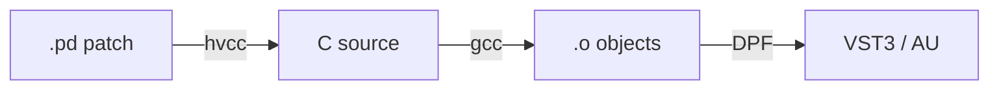

---
date:
  created: 2024-09-15
  updated: 2024-10-01
authors:
  - davide
tags:
  - hvcc
  - pure-data
  - build
categories:
  - Sviluppo
---

# Primo build con hvcc e DPF

Come ho configurato la toolchain per compilare patch Pure Data
in plugin VST3 nativi.

<!-- more -->

## Il problema

Pure Data è fantastico per prototipare DSP, ma i plugin che produce
tramite `[pd~]` o Camomile hanno limitazioni: dipendenze runtime,
latenza, compatibilità con le DAW.

## La soluzione: hvcc + DPF

La pipeline è questa:

hvcc compila la patch Pd in codice C puro, senza dipendenze.
DPF lo wrappa in un plugin con GUI.

## Oggetti supportati

!!! warning "Non tutto funziona"
    hvcc supporta solo un sottoinsieme di Pd vanilla.
    Oggetti come `[expr]`, `[soundfiler]`, `[tgl]` non sono
    supportati. Controllate sempre la lista di compatibilità.

## Risultato

Il primo plugin compilato: un semplice guadagno stereo.
Funziona in Ableton, REAPER e Bitwig senza problemi.
