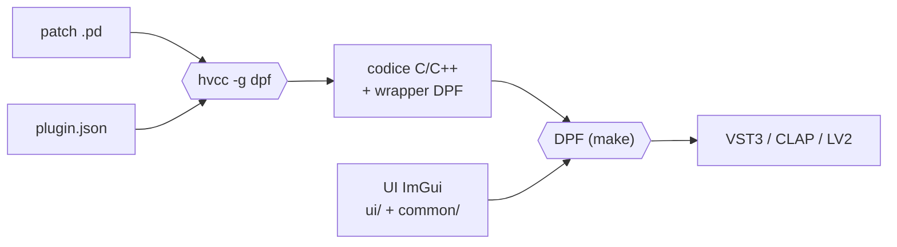
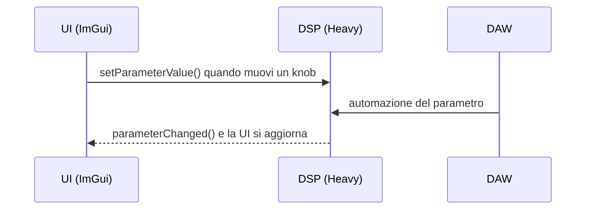
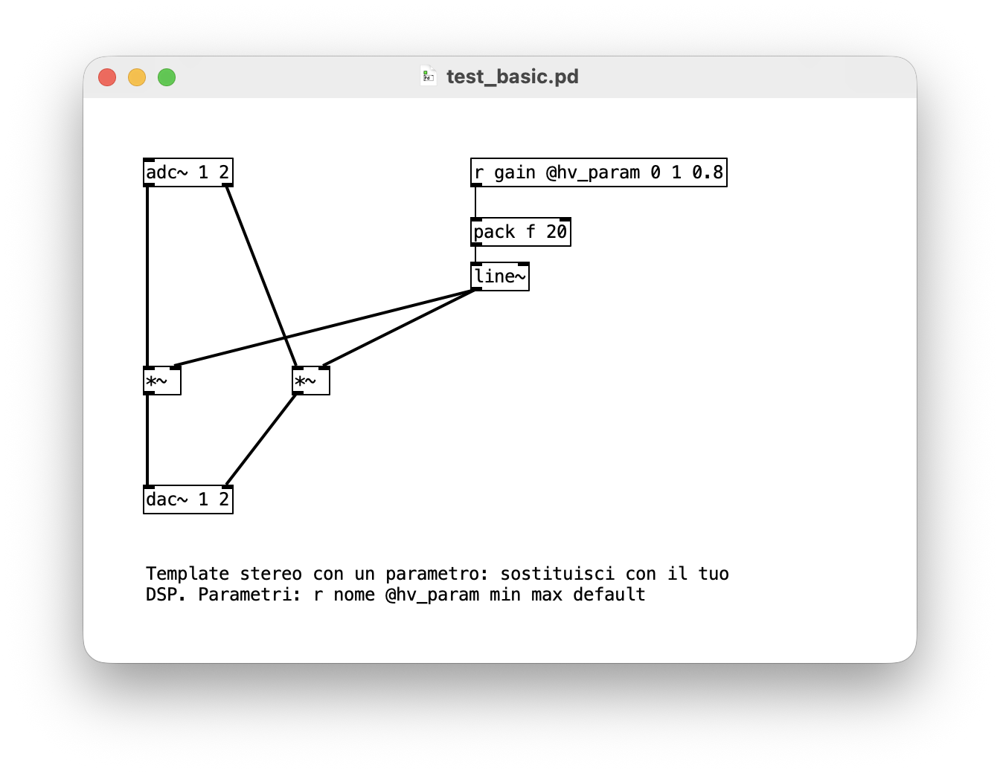
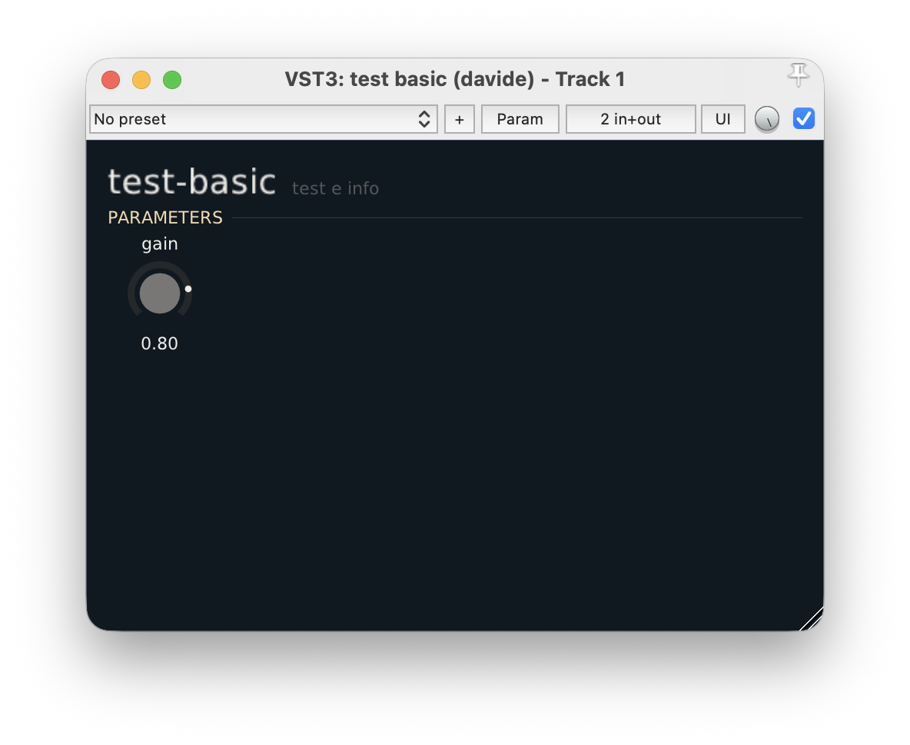
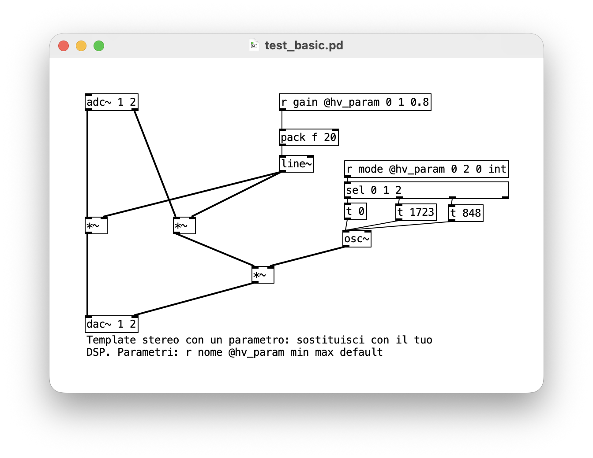
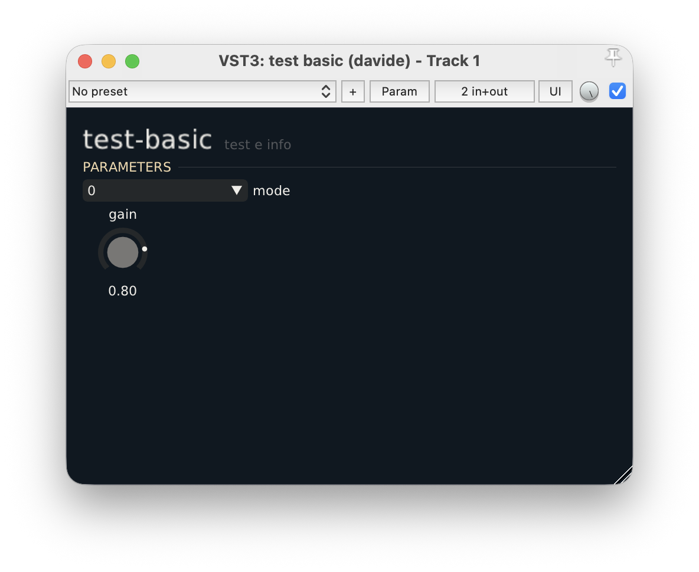
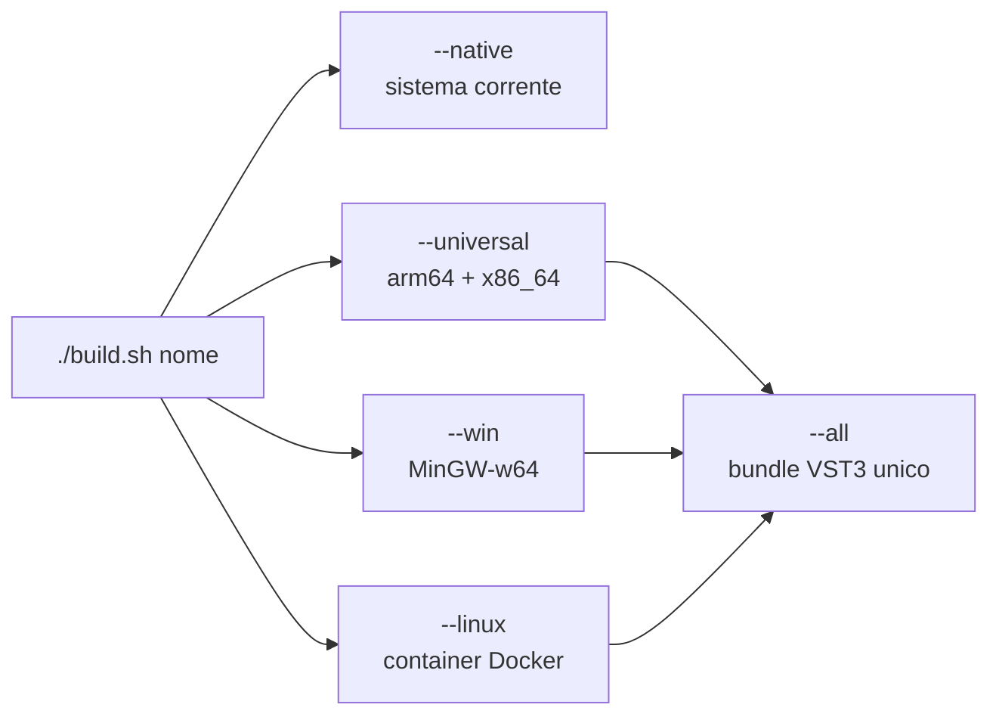

---
date:
  created: 2026-06-02
  updated: 2026-10-06
authors:
  - davide
tags:
  - puredata
  - hvcc
  - dpf
  - plugins
  - dsp
  - vst3
categories:
  - Plugin
---

# Sviluppo plugins in PureData con HVCC e DPF

Un ambiente di sviluppo per trasformare patch PureData in plugin audio `VST3` per macOS, Windows e Linux.

---------------------------------------------

<!-- more -->

## Introduzione

Questo post descrive come è strutturata e come funziona la [repository dev_plugin](https://github.com/dvddmg/dev_plugin){target="_blank"}, pensata per sviluppare **plugin audio** partendo da patch scritte in **PureData** o **PlugData**.

Il risultato finale sono tre plugin per la spazializzazione in formato `VST3`, disponibili per i tre sistemi operativi più diffusi: **macOS universal**, **Windows 64 bit**[^1] e **Linux 64 bit**[^1].

!!! note "Chi ha fatto cosa"

    I comandi di compilazione e parte del codice `C++` sono stati sviluppati con l'aiuto di **Claude Code**. La parte teorica e il DSP sono stati sviluppati personalmente.

L'ambiente è stato scritto e testato su **macOS**; le versioni per Windows e Linux sono ottenute tramite cross compilazione.

## Obiettivi

L'obiettivo principale è creare facilmente plugin audio per DAW, nei vari formati disponibili. L'ambiente non è scritto da zero: si appoggia a progetti open source consolidati, soprattutto per la conversione della patch Pd in codice `C++` e per la compilazione di `DSP` e `GUI`.

In sintesi, il percorso da patch a plugin è questo:



## Framework

L'ambiente di lavoro è strutturato come segue:

```text
.
├── README.md           // informazioni sull'ambiente
├── config.sh           // configurazione (autore, percorsi delle dipendenze)
├── new.sh              // crea il template di un nuovo plugin
├── build.sh            // compila i plugin
├── requirements.txt    // librerie Python installate nel venv
├── dep/                // dipendenze e submodule
├── src/                // codice sorgente e patch di tutti i plugin
├── common/             // codice C++ condiviso (colori UI e funzioni grafiche)
├── templates/          // file di partenza di un nuovo plugin (*.pd, *.json, UI.cpp)
├── docker/             // configurazione per la cross compilazione su Linux
├── parse_max_pd/       // studio sulla conversione da Pd a Max
└── venv/               // virtual environment Python
```

### Dipendenze

- [Heavy Compiler Collection (hvcc)](https://github.com/Wasted-Audio/hvcc/tree/32483a8fd348e793be0bcbcedd626e6335c61a6c){target="_blank"}

    `hvcc` è un compilatore scritto in **Python** che genera codice **C/C++** e una serie di wrapper per diversi framework audio. Supporta molte [piattaforme](https://github.com/Wasted-Audio/hvcc/blob/develop/docs/getting-started/index.md#supported-platforms){target="_blank"} e [framework](https://github.com/Wasted-Audio/hvcc/blob/develop/docs/getting-started/index.md#supported-frameworks){target="_blank"}. Prende una patch **PureData** e la traduce in codice per il framework scelto: qui usiamo `DPF`, che esporta plugin nei formati `LV2`, `VST2`, `VST3`, `CLAP` e `JACK`.

- [DPF - DISTRHO Plugin Framework](https://github.com/DISTRHO/DPF/tree/4238e1c7f0351bbe488d79f0899c540543ac7583){target="_blank"}

    `DPF` è il cuore del progetto: prende il codice generato da `hvcc` e lo compila nei formati elencati sopra. Fornisce anche un'interfaccia grafica di base, collegata al DSP in entrambe le direzioni tramite un'API `C++` basata su parametri.

- [DPF Widgets](https://github.com/DISTRHO/DPF-Widgets){target="_blank"}

    Raccolta di widget della community, utile per costruire `UI` personalizzate. È un submodule necessario alla compilazione.

Nella repository è inclusa anche la **Heavy Lib**, una collezione di abstraction per `Pd` scritte dagli autori di `hvcc`.

!!! note "PlugData e hvcc"

    **PlugData** include già `hvcc` e permette di compilare direttamente dal software. È comodo per iniziare, ma limitato quando serve controllare in modo preciso grafica, dipendenze e opzioni di compilazione: per questo qui `hvcc` viene usato da terminale.

!!! warning "Versioni fissate"

    I link di `hvcc` e `DPF` puntano a commit precisi: sono le versioni con cui l'ambiente è stato testato. Aggiornare i submodule può rompere la compilazione o cambiare il codice generato.

### Comunicazione tra UI e DSP

Ogni parametro esposto nella patch diventa un parametro del plugin. `DPF` lo mantiene sincronizzato tra interfaccia grafica, DSP e DAW:



## HVCC e DPF

Il primo passo è creare il virtual environment Python, attivarlo e installare i `requirements.txt`:

```bash
python3 -m venv venv
source venv/bin/activate
pip install -r requirements.txt
deactivate                      # per uscire dal venv quando hai finito
```

A questo punto nel terminale è disponibile il comando `hvcc`, che converte una patch in codice C++. Le opzioni disponibili sono descritte nella [documentazione di hvcc](https://github.com/Wasted-Audio/hvcc/tree/32483a8fd348e793be0bcbcedd626e6335c61a6c#usage){target="_blank"}. Per questo progetto serve questo comando:

```bash
hvcc nome_plugin.pd -g dpf -m plugin.json -o /cartella/di/output
```

Indichiamo la patch da compilare, il framework (`-g dpf`) e la cartella di output. L'opzione `-m plugin.json` è disponibile solo compilando da terminale: permette di passare impostazioni che sostituiscono quelle di default di `hvcc`.

??? example "Template di `plugin.json`"

    ```json
    {
        "name": "@NAME@",          // nome del plugin
        "nosimd": true,            // disattiva le ottimizzazioni SIMD (evita problemi di compilazione)
        "dpf": {                   // opzioni di DPF
            "dpf_path": "../../dep/",                   // percorso del submodule DPF
            "enable_ui": true,                          // attiva la UI
            "ui_size": {"width": 480, "height": 320},   // dimensione della finestra
            "description": "@DESCRIPTION@",             // descrizione
            "maker": "@MAKER@",                         // sviluppatore
            "brand_id": "@BRAND_ID@",                   // codice brand
            "unique_id": "@UNIQUE_ID@",                 // codice univoco (4 caratteri)
            "homepage": "@HOMEPAGE@",                   // sito web
            "plugin_uri": "@URI@",                      // pagina web del plugin
            "version": "1, 0, 0",                       // versione
            "license": "@LICENSE@",                     // licenza
            "midi_input": 0,                            // input MIDI
            "midi_output": 0,                           // output MIDI
            "plugin_formats": @FORMATS@                 // array dei formati desiderati
        }
    }
    ```

!!! warning "Niente commenti nel JSON reale"

    I commenti `//` qui sopra servono solo a spiegare i campi: il JSON standard non li ammette, quindi il `plugin.json` vero deve esserne privo, altrimenti `hvcc` non riesce a leggerlo.

!!! warning "`unique_id` deve essere davvero unico"

    La DAW riconosce il plugin da `brand_id` e `unique_id`. Due plugin con lo stesso codice vanno in conflitto, e cambiarlo dopo la pubblicazione fa sì che le sessioni salvate non trovino più il plugin.

### Creare un nuovo plugin

Il ciclo di lavoro tipico è questo:


Il comando `./new.sh <nome-plugin>` avvia un prompt che chiede tutte le informazioni necessarie, compresi i formati, e compila il template di `plugin.json` visto sopra. Al termine, in `src/` trovi il nuovo plugin con i file `.pd` e `.json` e la cartella `ui/`, dove i parametri vengono disegnati automaticamente come knob con la palette comune.

{width="100%"}
/// caption
La patch di default generata da `new.sh`.
///

Un po' come in **Max for Live**, la patch di default è già pronta per la compilazione. Possiamo esporre al plugin altri parametri, come mostrato nell'immagine.

!!! note "Esporre un parametro"

    In `hvcc` un parametro si dichiara con un oggetto `receive` seguito da `@hv_param`, il valore minimo, il massimo e quello di default, per esempio `[r gain @hv_param 0 1 0.5]`. Tutti i dettagli sono nella [documentazione di hvcc](https://wasted-audio.github.io/hvcc/latest/getting-started/patching/#exposing-parameters){target="_blank"}.

!!! warning "Solo oggetti supportati da Heavy"

    `hvcc` supporta solo un sottoinsieme degli oggetti di Pd vanilla e nessun external. Se la patch usa un oggetto non supportato, la compilazione si interrompe: conviene controllare l'elenco degli oggetti supportati prima di scrivere patch complesse.

Il plugin è già compilabile. Con questo comando vediamo il risultato:

```bash
./build.sh test-basic --install
```

L'opzione `--install` copia automaticamente il plugin nella cartella indicata in `config.sh`.

{width="100%"}
/// caption
Il plugin appena compilato, aperto nella DAW.
///

### Personalizzare l'interfaccia

L'interfaccia grafica usa l'API di [ImGui](https://github.com/ocornut/imgui){target="_blank"}, che permette di aggiungere controlli di vario tipo in poco tempo. Modificando il plugin `test-basic` come segue otteniamo un'interfaccia diversa:

{width="100%"}
/// caption
La patch con il nuovo parametro `mode`.
///

=== "src/test-basic/plugin.json"

    ```json
    {
        "name": "test_basic",
        "nosimd": true,
        "dpf": {
            //...
            "enumerators": {
                "mode": ["0", "1723", "848"]
            }
        }
    }
    ```

=== "src/test-basic/ui/HeavyDPF_test_basic_UI.cpp"

    ```cpp
    #include "PluginUIBase.hpp"

    START_NAMESPACE_DISTRHO

    class PluginUI : public PluginUIBase
    {
    protected:
        void drawContent() override
        {
            const float pad   = kPad * fZ;
            const float width = getWidth() - 2.0f * pad;

            ImGui::SetCursorPos(ImVec2(pad, pad));
            drawTitle("test-basic", "test e info");

            ImGui::SetCursorPosX(pad);
            sectionHeader("PARAMETERS", width);

            ImGui::SetCursorPosX(pad);
            static const char* const modeItems[] = { "uno", "due", "tre" };
            comboParam("mode", parammode, modeItems, 3, 140.0f * fZ);

            ImGui::SetCursorPosX(pad);
            knobParam("gain", paramgain, 0.0f, 1.0f, "%.2f");
        }
    };

    UI* createUI()
    {
        return new PluginUI();
    }

    END_NAMESPACE_DISTRHO
    ```

Il risultato è questo:

{width="100%"}
/// caption
La nuova interfaccia con il menu `mode` e il knob `gain`.
///

## Compilazione e cross compilazione

Per compilare si usa `./build.sh <nome-plugin> [opzioni]`:

| Opzione | Cosa fa |
|---|---|
| *(nessuna)* o `--native` | compila per il sistema su cui stai lavorando |
| `--universal` | macOS universal: Apple Silicon + Intel (solo da Mac) |
| `--win` | Windows 64 bit: da Mac con MinGW, nativo su Windows |
| `--linux` | Linux 64 bit: da Mac con Docker, nativo su Linux |
| `--all` | `--universal` + `--win` + `--linux`: un solo bundle per i tre sistemi |
| `--install` | copia il bundle nella cartella VST3 indicata in `config.sh` |
| `--clean` | cancella `build*` e `bin` del plugin prima di compilare |



!!! warning "Requisiti per la cross compilazione da macOS"

    - `--win` richiede `mingw-w64`, installabile con `brew install mingw-w64`.
    - `--linux` richiede **Docker** avviato: lo script crea al volo un ambiente Linux virtuale e compila al suo interno.

!!! warning "Windows e Linux: testati da macOS"

    Le build per Windows e Linux sono prodotte da macOS tramite cross compilazione. Prima di distribuirle conviene provarle su macchine reali: compilare senza errori non garantisce che il plugin si carichi correttamente in ogni DAW.

## Output

Con questa infrastruttura sono stati scritti i plugin `Orbita`, `Lontananza` e `Diffuser`.

[Download](https://github.com/dvddmg/dev_plugin/releases/latest){ .md-button .md-button--primary }

[^1]: Vedi il capitolo [Compilazione e cross compilazione](#compilazione-e-cross-compilazione) per dettagli su compatibilità e possibili errori.
