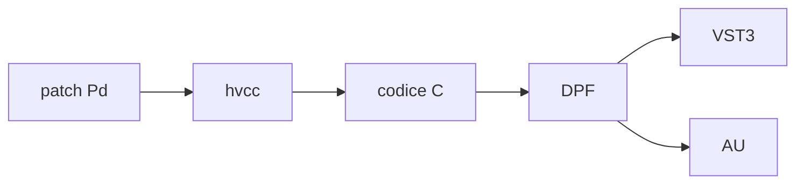
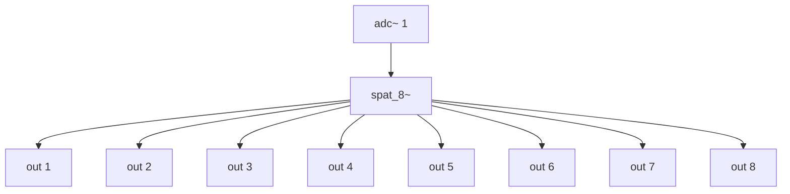
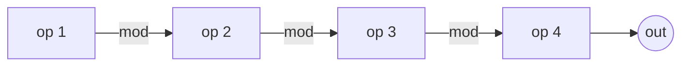
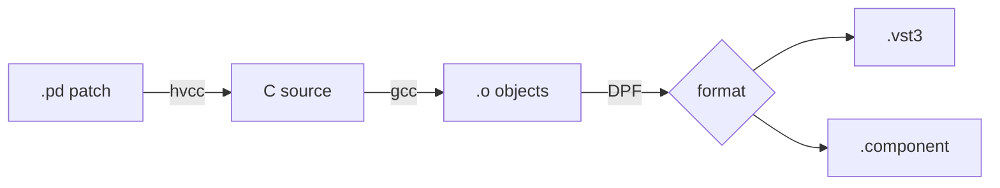

# Test page

Questa pagina è di test per vedere come funzionano alcune cose.

---

## Descrizione

Il plugin distribuisce un segnale mono su 8 uscite secondo una posizione
angolare (azimuth) e una distanza dal centro. Usa una legge di panning
basata su coseno rialzato per transizioni morbide tra canali adiacenti.

## Parametri

| Parametro   | Range     | Default | Descrizione |
|-------------|-----------|---------|-------------|
| `azimuth`   | 0 – 360° | 0°      | Posizione angolare della sorgente |
| `distance`  | 0 – 1    | 0.5     | Distanza dal centro (0 = centro, 1 = bordo) |
| `spread`    | 0 – 1    | 0.3     | Apertura della sorgente |
| `gain`      | -inf – 6 dB | 0 dB | Guadagno globale |

## Routing

```
         out 1
      /        \
  out 8          out 2
  |                  |
  out 7          out 3
      \        /
   out 6    out 4
       \  /
      out 5
```



## Signal flow


## FM routing


## Build pipeline


!!! tip "Suggerimento"
    Per un setup quadrifonico usa solo le uscite 1, 3, 5, 7
    e imposta `spread` a 0.5 per coprire i gap.

## Uso nella patch Pd

La patch sorgente si trova in `spat_8/patch/spat_8.pd`.

```pd
[adc~ 1]
|
[spat_8~]
|            \
[dac~ 1 2 3 4 5 6 7 8]
```

!!! warning "Oggetti non supportati da hvcc"
    La patch usa solo oggetti compatibili con hvcc.
    Se modifichi la patch, controlla la
    [lista di compatibilità](https://github.com/Wasted-Audio/hvcc/blob/develop/docs/09.Supported_vanilla_objects.md).

## Changelog

**v0.2.0** — aggiunto parametro `spread`

**v0.1.0** — prima release


```mermaid
graph TD
    IN[audio input] -->